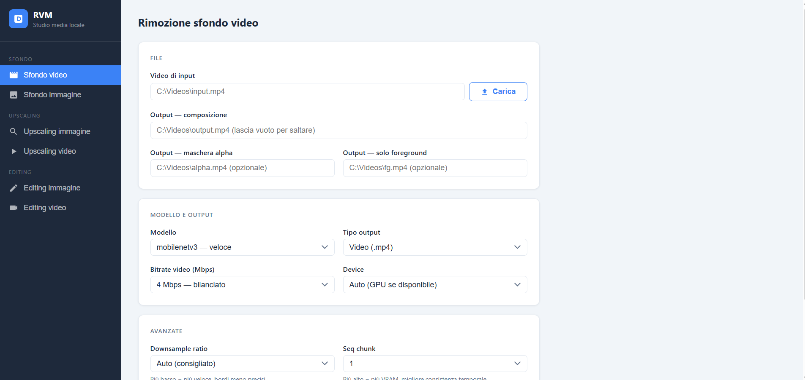

<h1 align="center">RVM — Remove Video Backgrounds Locally</h1>

<p align="center">
  <strong>AI background removal for video and images — no green screen, no cloud, no watermark.</strong><br/>
  One command installs it. Everything runs on your own machine.
</p>

<p align="center">
  
  
  
  
  
</p>

```bash
uv tool install git+https://github.com/metiu1/rvm-web
rvm
```

A browser opens at `http://localhost:7860`. That is the whole setup.

<p align="center">
  
</p>

---

## What it does

Drop in a video, get it back with the background gone — no green screen, no
subscription, no upload. RVM runs [RobustVideoMatting](https://github.com/PeterL1n/RobustVideoMatting)
locally and exports **real RGBA transparency**, not a fake-transparent MP4:
composited MP4, alpha mask, or a PNG sequence you can drop straight into
After Effects, DaVinci Resolve or Premiere.

Around that sits a small local media studio — image cutout, AI upscaling, and
image/video editing — so the footage never has to leave your computer.

**Why not a web tool:** online background removers cap the resolution, watermark
the result, queue your job and keep your footage on their servers. This has no
cap, no watermark, no queue and no server. Your GPU does the work, your disk
keeps the file.

---

## Features

Sidebar navigation with six tools:

- **Video background removal** ([RobustVideoMatting](https://github.com/PeterL1n/RobustVideoMatting)) — MobileNetV3 (fast) or ResNet50 (accurate); export as MP4 composition, alpha mask, or PNG sequence with real RGBA transparency
- **Image background removal** ([rembg](https://github.com/danielgatis/rembg) / U2Net) — upload a photo, get a transparent PNG, with before/after preview
- **Image upscaling** — 2× / 4×, Lanczos (no extra deps) or Real-ESRGAN (AI)
- **Video upscaling** — 2× / 4×, Lanczos or Real-ESRGAN, **original audio preserved** (muxed back via bundled ffmpeg)
- **Image editing** (Pillow) — crop, resize, rotate/flip, brightness/contrast/saturation/sharpness, filters (B&W, sepia, invert, blur, sharpen, auto-enhance), format convert + quality (PNG/JPG/WEBP), live before/after preview
- **Video editing** (bundled ffmpeg) — trim, crop, resize, change speed, compress, format convert, export GIF, extract audio, mute, reverse — with live progress

Plus:

- GPU accelerated (CUDA) with automatic CPU fallback
- Upload files directly from the browser (saved to `~/Downloads/rvm-uploads/`)
- `ffmpeg` ships bundled via `imageio-ffmpeg` — no system install required
- Installable in one command via `uv`

---

## Quick Install

Requires [uv](https://docs.astral.sh/uv/getting-started/installation/).

```bash
uv tool install git+https://github.com/metiu1/rvm-web
rvm
```

A browser window opens automatically at `http://localhost:7860`.
(The old `rvm-web` command still works as an alias.)

### CUDA (NVIDIA GPU) — recommended

On Windows, PyPI serves **CPU-only** torch by default. To get GPU
acceleration, tell uv to auto-detect your CUDA driver and pull matching
wheels:

```bash
uv tool install --reinstall --torch-backend=auto git+https://github.com/metiu1/rvm-web
```

Or set it once for every future install (persists across terminals):

```powershell
# PowerShell (Windows) — set once
[Environment]::SetEnvironmentVariable('UV_TORCH_BACKEND','auto','User')
```

```bash
# bash/zsh (Linux/macOS) — add to your shell profile
export UV_TORCH_BACKEND=auto
```

Verify CUDA is active — the upscaling log shows `Modello caricato su cuda:0`,
or check directly:

```bash
uv tool run --from rvm python -c "import torch; print(torch.cuda.is_available())"
```

> **Real-ESRGAN** AI upscaling is **built-in** — no extra packages needed.
> Model weights download automatically on first use to `~/.cache/rvm_web/`.
> `imageio-ffmpeg` (bundled ffmpeg, used to keep audio when upscaling video)
> is also installed automatically.

---

## Parameters

| Parameter | Options | Default |
|---|---|---|
| Model | mobilenetv3, resnet50 | mobilenetv3 |
| Output type | video, png_sequence | video |
| Downsample ratio | auto, 0.25, 0.5, 0.75, 1.0 | auto |
| Bitrate (Mbps) | 1, 2, 4, 8, 16 | 4 |
| Device | auto, cpu, cuda | auto |
| Seq chunk | 1, 2, 4, 8 | 1 |
| Workers | 0, 1, 2, 4 | 0 |

---

## Image Background Removal

The image section uses [rembg](https://github.com/danielgatis/rembg) with the U2Net model.  
On **first use**, the model (~170 MB) is downloaded automatically to `~/.u2net/`.  
Output is a PNG with full alpha transparency.

---

## Upscaling

Both image and video upscaling support 2× and 4× with two methods:

- **Lanczos** — classic high-quality resampling, no extra dependencies, fast.
- **Real-ESRGAN** — AI super-resolution, built-in (no extra packages). Model
  weights download automatically on first use to `~/.cache/rvm_web/`.

For **video** upscaling the original audio track is preserved: the video is
upscaled frame-by-frame, then the audio is muxed back with ffmpeg
(`imageio-ffmpeg`, bundled). If no audio track exists the video is written
directly.

---

## Known Fix — `av` Compatibility

RVM's `inference_utils.py` passes frame rate as a string to `av.add_stream()`.  
Newer `av` versions require a `Fraction`. The fix is applied automatically on first run.

---

## Credits

- [RobustVideoMatting](https://github.com/PeterL1n/RobustVideoMatting) by Peter Lin et al.
- Web UI built with [FastAPI](https://fastapi.tiangolo.com/)

---

## License

MIT
